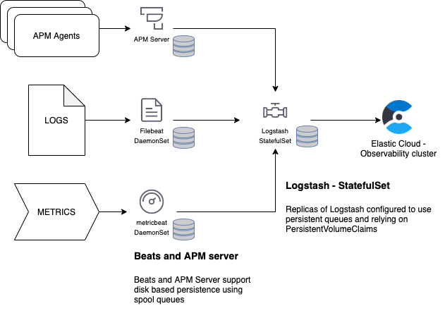

# Setting up observability of Kubernetes clusters and applications with Elastic

## Intro
This page describes how to observe applications and Kubernetes clusters using Elastic stack components.

## Prerequisites and architecture
* Helm
* Elastic Cloud - two clusters:
  * Main Elastic cluster to collect logs, metrics and APM data from Kubernetes applications and components.
  * Elastic monitoring cluster - collecting performance metrics and logs from Elastic application monitoring cluster, as well as other monitoring components.
* Filebeat:
  * Filebeat DaemonSet - collecting application and Kubernetes logs sending data into Elastic application monitoring cluster.
  * Filebeat instance to collect logs from monitoring components to send it to Elastic stack monitoring cluster.
* Metricbeat:
  * Metricbeat DaemonSet to collect Kubernetes pods metrics to be sent to Elastic application monitoring cluster.
  * Metricbeat pod to collect Kubernetes cluster metrics from `kube-stats-metrics` sending them to Elastic application monitoring cluster.
  * Metricbeat pod monitoring other Elastic monitornig components and sending data to Elastic monitoring cluster.
* APM server - used for application performance monitoring of applications deployed on Kubernetes.
* Logstash - deployed as StatefulSet deployment and acting as a forward proxy for components communicating with Elastic application monitoring cluster. The purpose of Logstash here is to also serve as a persistent queue to prevent data loss in case of Elastic cluster outages.

## Diagrams
### Monitoring Kubernetes and applications using Filebeat and Metricbeat DaemonSet

### Data flow into Observability cluster

### Monitoring the monitors


## Install
### Deploy ECK operator
```
kubectl apply -f https://download.elastic.co/downloads/eck/1.2.1/all-in-one.yaml
```

### At start only: Add Helm repo
```
helm repo add elastic https://helm.elastic.co
```

### At start only: Update and install secrets
```
./scripts/create_secrets.sh
```

### Deploy metricbeat and filebeat to monitor ES/Kibana/Logstash and collect logs from them.
```
helm upgrade monitor elastic/metricbeat -f metricbeat/metricbeat-monitoring-helm-values.yaml --namespace elastic-monitoring
```

### At start only: Run beats setup
```
kubectl create -f filebeat/filebeat-setup.yml --namespace elastic-monitoring
kubectl create -f metricbeat/metricbeat-setup.yml --namespace elastic-monitoring

```

### Deploy Logstash proxies
```
helm install proxy elastic/logstash --namespace elastic-monitoring -f logstash-proxy/logstash-helm-values.yaml
```

### Install Filebeat and Metricbeat DaemonSets
Wait for the setup jobs to complete and Logstash proxies to start
```
helm install ds elastic/filebeat -f filebeat/filebeat-helm-values.yaml --namespace elastic-monitoring
helm install mb elastic/metricbeat -f metricbeat/metricbeat-helm-values.yaml --namespace elastic-monitoring

```
